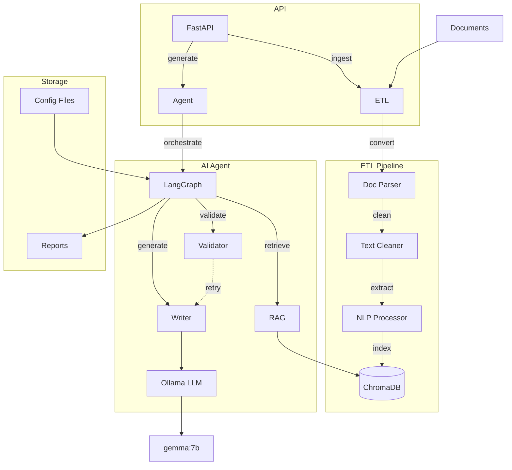

# --- AGENT_VF/README.md ---

# Agent IA de Rédaction de Mémoire d'Alternance (Version Locale)

Ce projet contient un agent IA **100% local** conçu pour assister à la rédaction de mémoires de mission professionnelle, basé sur LangGraph pour l'orchestration.

## Description

L'agent utilise une architecture modulaire open-source pour gérer le cycle de vie de la génération de contenu :

1.  **ETL (`etl/`)**: Ingestion et préparation des documents sources (comptes-rendus, notes, etc.) localement. Convertit divers formats en texte, nettoie le texte, extrait les métadonnées (dates, entités) et indexe le contenu dans une base de données vectorielle locale (ChromaDB).
2.  **RAG (`rag/`)**: Système de Retrieval-Augmented Generation utilisant ChromaDB et un modèle d'embedding local (Sentence Transformers) pour récupérer le contexte pertinent.
3.  **Writer (`writer/`)**: Client LLM local via **Ollama** (ex: `gemma:7b`) responsable de la génération du texte pour chaque chapitre.
4.  **Validation (`validation/`)**: Module pour vérifier la conformité du texte généré (structure, longueur).
5.  **Orchestrator (`orchestrator/`)**: Utilise **LangGraph** pour modéliser et exécuter la boucle agentique de génération (RAG -> Writer -> Validation -> Re-prompt si nécessaire).
6.  **API (`api/`)**: Interface RESTful (FastAPI) pour interagir avec l'agent : lancer l'ingestion, demander la génération d'un chapitre, et récupérer les résultats.
7.  **Core (`core/`)**: Contient les modèles de données Pydantic partagés.
8.  **Tests (`tests/`)**: Contient les tests unitaires et d'intégration (à implémenter).

**Aucune dépendance externe propriétaire ou cloud n'est requise pour l'exécution principale.**

## Architecture


```
Le projet AGENT_VF est organisé selon la structure suivante :
AGENT_VF/
├── api/                  # API du service
│   ├── __init__.py
│   └── main.py
├── core/                 # Modèles Pydantic partagés
│   ├── __init__.py
│   └── models.py
├── etl/                  # Module ETL refactorisé
│   ├── __init__.py
│   ├── cleaning.py
│   ├── conversion.py
│   ├── extraction.py
│   ├── indexation.py
│   └── transformation.py
├── orchestrator/         # Orchestration des workflows
│   ├── __init__.py
│   └── workflow.py
├── rag/                  # Retrieval Augmented Generation
│   ├── __init__.py
│   └── retriever.py
├── tests/                # Tests unitaires et d'intégration
│   └── __init__.py
├── validation/           # Validation des données
│   ├── __init__.py
│   └── validator.py
├── writer/               # Client pour génération de contenu
│   ├── __init__.py
│   └── client.py
├── etl_scripts/          # Scripts ETL originaux
│   ├── cleaning.py
│   ├── conversion.py
│   ├── extraction.py
│   ├── indexation.py
│   └── transformation.py
├── backlog.json          # Suivi des fonctionnalités
├── prompts_spec.json     # Spécifications des prompts
├── .env.example          # Exemple de configuration
├── README.md             # Documentation
└── requirements.txt      # Dépendances
```

## Installation

1.  **Prérequis :**
    *   Python 3.10+
    *   Git
    *   **Ollama installé et fonctionnel** : Suivez les instructions sur [ollama.com](https://ollama.com/).
    *   Téléchargez le modèle LLM désiré via Ollama (ex: `ollama pull gemma:7b`).

2.  **Cloner le repository :**
    ```bash
    git clone <url_du_repository>
    cd AGENT_VF
    ```

3.  **Créer un environnement virtuel et l'activer :**
    ```bash
    python -m venv venv
    source venv/bin/activate  # Linux/macOS
    # ou
    .\venv\Scripts\activate  # Windows
    ```

4.  **Installer les dépendances Python :**
    ```bash
    pip install -r requirements.txt
    ```
    *Note : L'installation de `torch` peut varier selon votre système (CPU/GPU). Consultez la documentation PyTorch si nécessaire.*

5.  **Télécharger les modèles linguistiques nécessaires :**
    *   Modèle spaCy pour l'extraction d'entités :
        ```bash
        python -m spacy download fr_core_news_sm
        ```
    *   Le modèle d'embedding (Sentence Transformers) sera téléchargé automatiquement par LangChain/HuggingFace lors de la première utilisation si non présent dans le cache.

6.  **Configurer les variables d'environnement (Optionnel) :**
    Créez un fichier `.env` à la racine en copiant `.env.example`. Modifiez les valeurs si vos configurations locales diffèrent des valeurs par défaut (ex: URL Ollama, chemin ChromaDB).
    ```dotenv
    # .env
    # OLLAMA_BASE_URL=http://localhost:11434
    # OLLAMA_MODEL=gemma:7b
    # CHROMA_DB_PATH=./chroma_db
    # INPUT_DOCS_DIR=./data/input_documents
    # GENERATED_REPORTS_DIR=./generated_reports
    ```

## Lancer l'Application

1.  **Assurez-vous que le serveur Ollama est lancé** avec le modèle requis disponible.
    ```bash
    ollama serve & # Ou lancez l'application de bureau Ollama
    ollama list   # Pour vérifier les modèles disponibles
    ```

2.  **Démarrer l'API FastAPI :**
    Ouvrez un terminal, activez l'environnement virtuel (`source venv/bin/activate`) et lancez :
    ```bash
    uvicorn api.main:app --reload --host 0.0.0.0 --port 8000
    ```
    L'API sera accessible sur `http://localhost:8000`. L'interface Swagger UI est sur `http://localhost:8000/docs`.

## Utilisation de l'API

*   **Lancer l'ingestion :**
    Placez vos documents sources dans le répertoire spécifié (par défaut ou via `INPUT_DOCS_DIR` dans `.env`). Puis envoyez une requête POST à `/ingest`.
    ```bash
    curl -X POST http://localhost:8000/ingest \
         -H "Content-Type: application/json" \
         -d '{"directory_path": "./data/input_documents"}' # Adaptez le chemin
    ```
    L'ingestion crée/met à jour la base ChromaDB dans le chemin spécifié (`CHROMA_DB_PATH`).

*   **Lancer la génération d'un chapitre :**
    Envoyez une requête POST à `/generate/{us_id}` (ex: `/generate/US001`).
    ```bash
    curl -X POST http://localhost:8000/generate/US001 \
         -H "Content-Type: application/json" \
         -d '{"max_retries": 2}' # Optionnel: spécifier le nombre de tentatives
    ```
    L'API exécutera le workflow LangGraph et retournera le résultat final (succès ou échec) de manière synchrone.

*   **Récupérer un rapport généré (Simulation) :**
    Si la génération réussit, le contenu est dans la réponse de `/generate`. Cet endpoint simule une récupération si les résultats étaient stockés séparément.
    ```bash
    curl http://localhost:8000/report/US001 # Ne fonctionnera que si un fichier US001_result.json existe
    ```

# End of file
